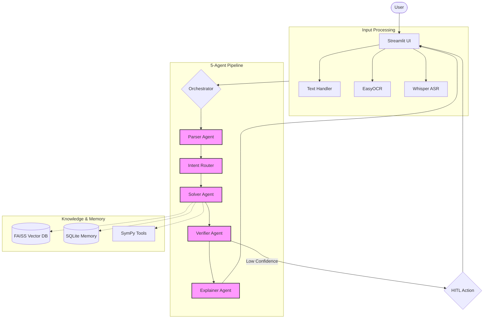

# Design Document: Multi-Agent Math Mentor AI

## Overview
The Multi-Agent Math Mentor AI is an end-to-end system designed to solve complex JEE-style mathematics problems. It leverages a multimodal input pipeline, a Retrieval-Augmented Generation (RAG) system, and a 5-agent orchestration framework powered by Groq's Llama-3.1-8b-instant model.

## System Architecture Diagram

## System Architecture Details

### 1. Multimodal Input Layer
The system accepts input in three formats:
- **Text**: Standard typed input, cleaned via `inputs/text_handler.py`.
- **Image**: Processed using **EasyOCR** to extract mathematical expressions from photos or screenshots.
- **Audio**: Transcribed using **OpenAI Whisper** for voice-based problem entry.

### 2. Orchestration Layer (`orchestrator.py`)
The orchestrator manages the high-level workflow, ensuring sequential execution of the 5-agent pipeline and managing the state transition between agents.

### 3. Agentic Layer (`agents/`)
The core intelligence is distributed across five specialized agents:
- **Parser Agent**: Cleans raw input (OCR/ASR artifacts) and structures it into a machine-readable JSON format.
- **Intent Router Agent**: Analyzes the problem to decide the optimal solving strategy and which symbolic tools (SymPy) to invoke.
- **Solver Agent**: Combines RAG context, memory, and symbolic tool results to generate a step-by-step mathematical solution.
- **Verifier Agent**: Acts as a critic, checking the solution for logical leaps, domain violations, and numerical accuracy.
- **Explainer Agent**: Transforms the verified technical solution into a student-friendly markdown tutorial with a friendly tutor persona.

### 4. Knowledge & Retrieval Layer (`rag/`)
- **RAG Pipeline**: Uses **FAISS** to index and retrieve relevant snippets from a mathematical knowledge base.
- **Embeddings**: Powered by `sentence-transformers` for semantic similarity search.

### 5. Memory & Learning Layer (`memory/`)
- **SQLite Database**: Stores every solved problem, its solution, and associated metadata.
- **Long-term Memory**: Uses **TF-IDF similarity** to retrieve past problems that are semantically similar to the current one, allowing the solver to reuse proven strategies.

### 6. Human-in-the-Loop (HITL)
The system proactively requests human intervention when:
- OCR/ASR confidence is below a predefined threshold.
- The Parser Agent finds the input ambiguous.
- The Verifier Agent's confidence score is low.

### 7. User Interface (`app.py`)
A **Streamlit** dashboard provides:
- Real-time input handling and OCR/ASR previews.
- Interactive HITL prompts for manual corrections.
- Rich visualization of agent "traces" (execution logs).
- Latex rendering for mathematical formulas and step-by-step explanations.

## Technology Stack
- **LLM**: Groq (Llama-3.1-8b-instant)
- **Frontend**: Streamlit
- **OCR**: EasyOCR
- **ASR**: OpenAI Whisper
- **Math Tools**: SymPy
- **Vector DB**: FAISS
- **Database**: SQLite3
